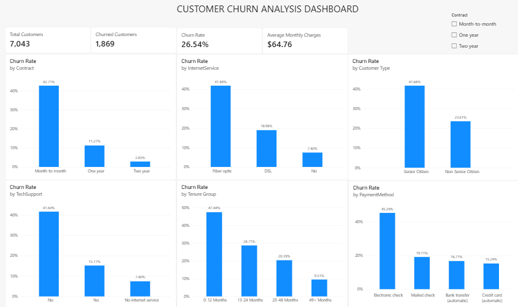

# Customer Churn Analysis

## Project Overview

This project analyzes customer churn for a telecommunications company using Python, MySQL, and Power BI. The objective is to identify customer segments associated with higher churn rates and present business insights through data analysis and visualizations.

## Dashboard Preview



The Power BI dashboard summarizes customer churn through KPI cards and visualizations covering contract type, internet service, customer type, tech support, tenure, and payment method.

## Tools & Technologies

- **Python:** Pandas, Matplotlib
- **SQL:** MySQL
- **Data Visualization:** Microsoft Power BI
- **IDE:** Visual Studio Code

## Dataset

This project uses the publicly available Telco Customer Churn dataset, which contains customer demographics, subscribed services, contract information, billing details, tenure, and churn status.

**Dataset Source:** [Telco Customer Churn — Kaggle](https://www.kaggle.com/datasets/blastchar/telco-customer-churn)

**Usage:** The dataset is used for educational and portfolio purposes. SQL queries, Python analysis, visualizations, and the Power BI dashboard were developed as part of this project.

## Key Performance Indicators

- **Total Customers:** 7,043
- **Churned Customers:** 1,869
- **Retained Customers:** 5,174
- **Overall Churn Rate:** 26.54%
- **Average Monthly Charges:** $64.76
- **Average Customer Tenure:** 32.37 months

## Key Findings

- Month-to-month contracts have a churn rate of 42.71%, compared with 11.27% for one-year contracts and 2.83% for two-year contracts.
- Customers with 0–12 months of tenure have a churn rate of 47.44%.
- Fiber optic customers have a churn rate of 41.89%.
- Customers paying by electronic check have a churn rate of 45.29%.
- Customers without tech support have a churn rate of 41.64%.

These findings show associations between customer characteristics and churn; they do not establish causation.

## Project Components

- `churn_analysis.py` — Python data analysis and visualizations.
- `customer_churn_setup.sql` — SQL database setup.
- `customer_churn_analysis.sql` — SQL queries for churn analysis.
- `customer_churn_dashboard.pbix` — Power BI dashboard.
- `churn_by_contract.png` — Churn rate by contract type.
- `churn_by_tenure.png` — Churn rate by customer tenure.
- `churn_by_internet_service.png` — Churn rate by internet service.
- `churn_by_payment_method.png` — Churn rate by payment method.

## How to Run

1. Install Python.
2. Install the required packages:

   ```bash
   pip install pandas matplotlib
   ```

3. Place the dataset CSV in the same folder as `churn_analysis.py`.
4. Run the Python script:

   ```bash
   python churn_analysis.py
   ```

5. Open the SQL scripts in MySQL Workbench to run the database analysis.
6. Open `customer_churn_dashboard.pbix` in Power BI Desktop to explore the dashboard.

## Disclaimer

This is an educational portfolio project using a publicly available dataset. The dataset was not collected independently.
